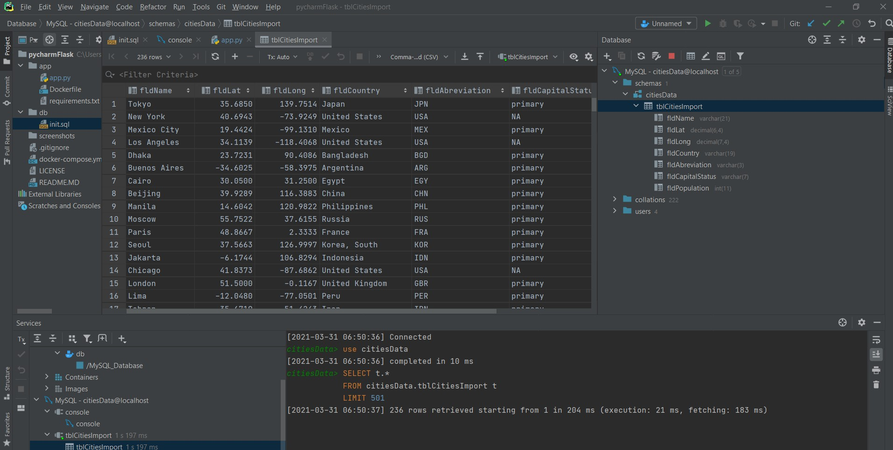
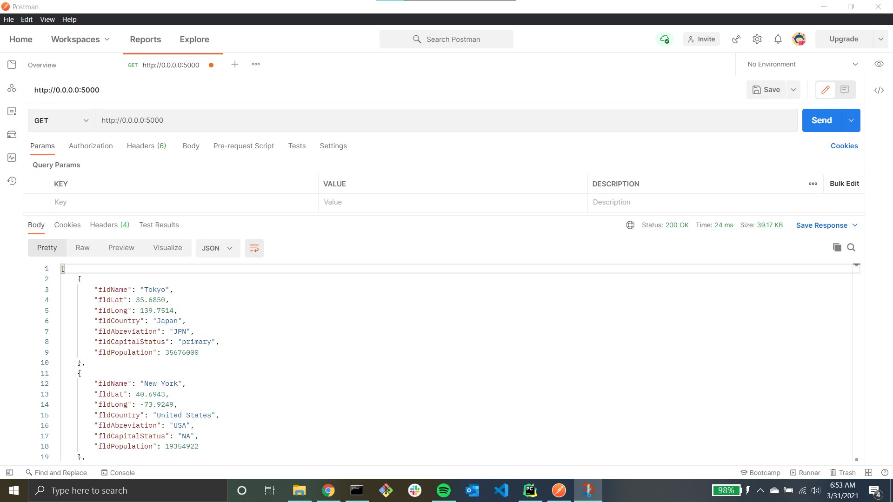
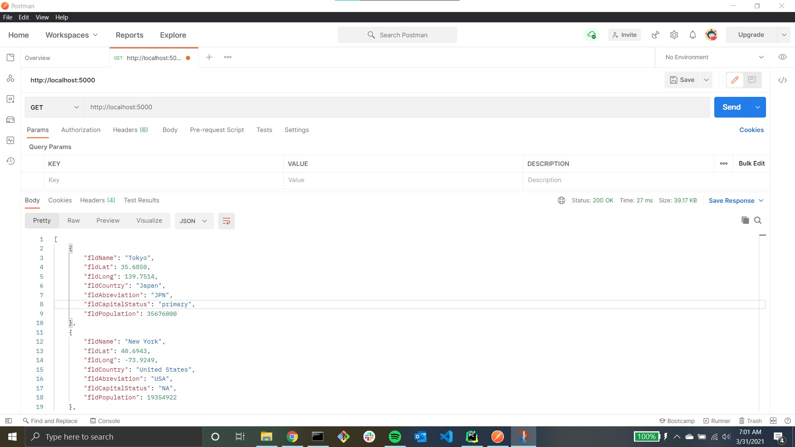
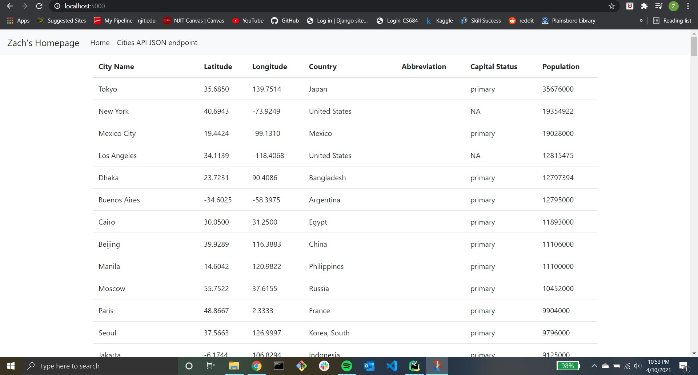
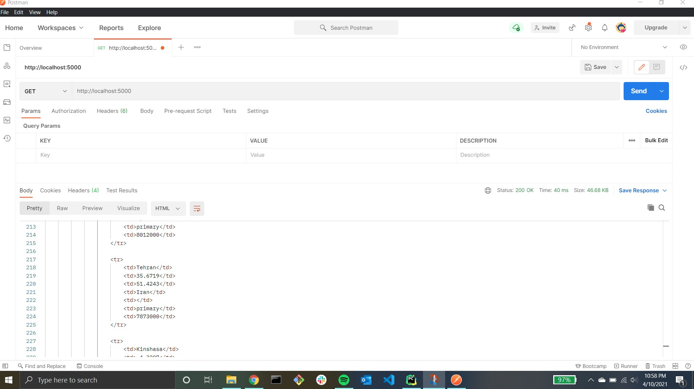
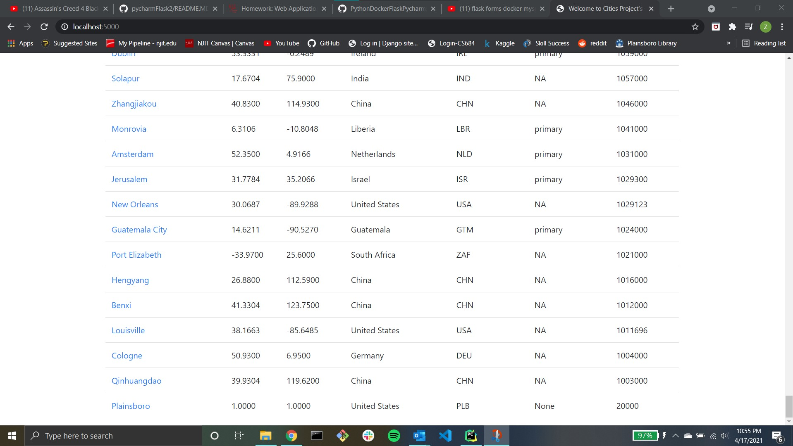
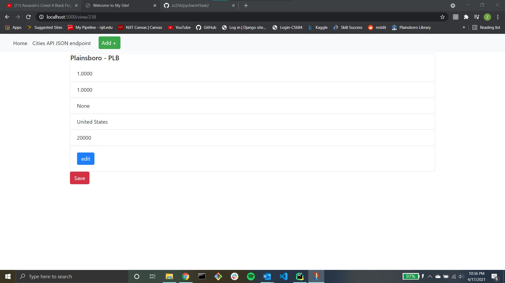
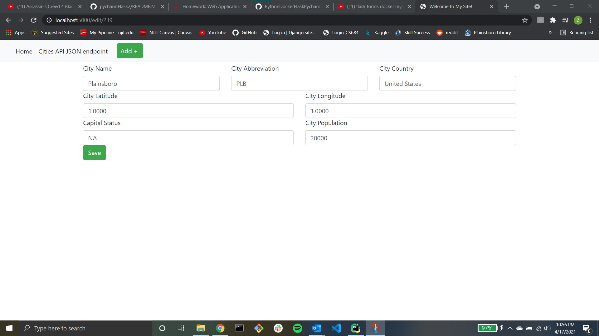
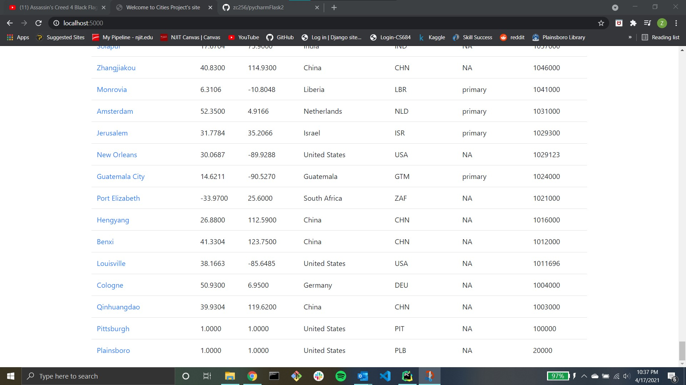
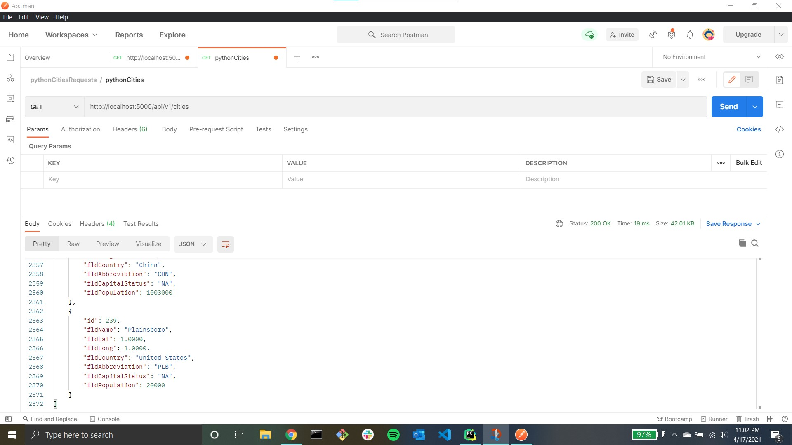

# Project Description
This project is a homework assignment to teach how to get Pycharm setup with Docker, Flask, and MySQL. A video is included in the screenshots to show that the delete functionality works.
# MySQL Database

# Postman Screenshot

# Postman Screenshot (with localhost:5000)

# Formatted Index Page 

# Formatted Postman Output

# Add New Entry

# View New Entry

# View Edit Screen of New Entry

# Edit New Value (Capital Status: None --> NA)

# View Final Edit

# Postman - New Entry

